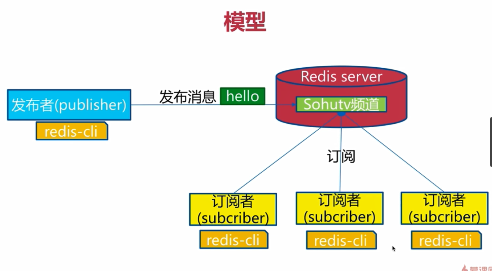

## 盛赞redis

* 高性能Key-Value服务器
* 多种数据结构
* 丰富的功能
* 高可用分布式支持

### Redis初认识

* redis是什么
    * 开源(作者：Salvatore Sanfilippo(antirez))
    * 多种数据结构
    * 基于键值的存储服务系统
    * 高性能
* redis特性回顾
    * 速度快
    ```
    官方速度：10w OPS
    存储：内存
    语言：C语言
    线程模型：单线程
    ```
    * 持久化
        ```
        将所有数据保持在内存中，将数据的更新将异步保存在磁盘上
        ```
    * 多种数据结构
        ```
        Strings/Blobs/Bitmaps
        Hash Tables(objects)
        Linked Lists
        Sets
        Sorted Sets

        新版本：
            BitMaps：位图
            HyperLogLog：嘲笑内存唯一计数
            GEO：地理信息定位

        ```
    * 支持多种编程语言
        ```
        java,php,python,ruby,lua,nodejs
        ```
    * 功能丰富
        ```
        发布订阅;事物;Lua脚本;pipeline
        ```
    * 简单
        ```
        23.000 lines of code
        不依赖外部库(like libevent)
        单线程模型
        ```
    * 主从复制
        ```
                ---从
        主--copy---从
                ---从
        ```
    * 高可用、分布式
        ```
        高可用--》redis-Sentinel(v2.8)支持高可用
        ```

#### redis典型的应用场景
* 缓存系统
    ```
    App Server
        |
      cache
        |
      Storage
    ```

* 计数器
    ```
    评论，转发
    ```
* 消息队列
    ```
    products--message--customer
    ```
* 排行榜
* 社交网络
* 实时系统

#### redis安装
* redis安装
    ```
    wget http://download.redis.io/releases/redis-3.0.7.tar.gz
    tar -xzf redis-3.0.7.tar.gz
    In -s redis-3.0.7 redis
    cd redis
    make&&make install

    ```
   
* 可执行文件说明
    ```
     redis-server      ==>redis服务器
     redis-cli         ==>redis命令行客户端
     redis-benchmark   ==>redis性能测试
     redis-check-aof   ==>aof文件修复
     redis-check-dump  ==>rdb文件修复
     redis-sentinel    ==>sentinel服务器
    ```
* 三种启动方法
    * 最简启动
        ```
        启动：
        redis-server
        验证：
        ps -ef|grep redis
        netstat -antpl|grep redis
        redis-cli -h ip -p port ping
        ```
    * 动态参数启动
        ```
        redis-server -port 6380
        ```
    * 配置文件启动
        ```
        redis-server configPath
        ```
    * 比较
        ```
        生产环境选择配置启动
        单机多实例配置文件可以用端口区分开

        ```
* 简单的客户端连接
    ```
    redis-cli -h 114.55.32.150 -p 6384
    ping
    set hello world
    get hello
    (类似于打乒乓球)
    状态回复：ping--->pong
    错误回复：hget hello field-->(error) WRONGGTYPE Operation against
    整数回复：incr hello-->(integer) 1
    字符串回复：get hello -->"world"
    多行字符串回复：mget hello foo
    1)"world"
    2)"bar"
    ```
* redis常用配置
    ```
    daemonize:是否为守护进程
    port:redis对外端口号
    logfile:redis系统日志
    dir:redis工作目录()
    默认端口：6379(merz意大利歌手名字，诺基亚)
    配置文件步骤：
    mkdir config
    cp redis.conf config
    cd config
    vim redis-6381.confg
    cat redis-6381.conf| grep -v "#" | grep -v "^$" > redis-6382.conf
    redis-server config/redis-6382.conf

    ```

### API的理解和使用

* 通用命令
    * 通用命令
        ```python
        keys [patter] #遍历所有key;一般不在生产环境中使用
            热备从节点
            scan
        dbsize #计算key的总数(内置计数器)
        exists key  #检查key是否存在(存在返回1，不存在返回0)
        del key #删除指定的key
        expire key seconds  #key在sencods过期
            ttl key #查看key剩余过期时间
            persist key # 去掉key的过期时间
        type key    #返回key的类型
        除了keys:O(n),其他都是O(1)
        ```
    * 数据结构和内部编码

    
    
    
    * 单线程架构
        ```
        set-set-get-del-get==redis

        why it so qucik!
        # 1. 纯内存
        # 2. 非阻塞IO
        # 3. 避免线程切换和竞争
        ### 注意事项
        1. 一次只运行一条命令
        2. 拒绝长命令
        3. 其实不是单线程
            fysnc file descriptor
            close file descriptor
        ```

#### 字符串类型

* 结构和命令

    
    
```python
    场景：
    1.缓存
    2.计数器
    3.分布式锁
    3.等等
    incr key #自增一
    decr key #减一
    incrby key
    decrby key
    incr userid:pageview(单线程，无竞争)

```

* 快速实战


```python

    mget和mset批量进行操作
    getset key newvalue #set key newvalue并返回旧的value
    append key value #将value追加到旧的value
    strlen key #返回字符串的长度(注意中文)

    incrbyfloat key 3.5  #增加key对应的值为3.5
    getrange key start end #获取字符串指定下标的值
    setrange key index value #设置指定下标所有对应的值

```

* 内部编码
* 查缺补漏

    
----

#### 哈希类型

* 特点


* 重要API

```python
其实可以理解为一张表的结构
hget key filed # 获取hash key 对应的field的value
hset key field value # 设置hash key 对应field的value
hdel key field # 删除hash key 对应field的value
hexists key field # 判断hash  key 是否有field
hlen key # 获取hash key field的数量
hmget
hmset

hgettall key # 返回hash key对应所有的field和value
hvals key #返回hash key 对应所有field的value
hkeys key # 返回hash key对应所有field
```

* hash vs string


* 查缺补漏

#### 列表类型
* 特点
    ```
    有序
    重复
    ```


* 重要API
    ```python
    rpush key value1 value2 ... #从列表右端插入值(1-N个)
    lpush key value1 value2... # 从列表左端插入值
    linsert key before|after value newvalue
    lpop key
    rpop key
    lrem key count value
    ltrim #按照索引范围修剪列表
    lrange key start end(include end) # 获取指定范围的值
    lindex key
    llen key
    lset key index newvalue
    blpop key timeout #lpop阻塞版本，timeout是阻塞超时间，timeout=0为永远不阻塞
    tips

    ```


* 实战
* 查缺补漏


#### 集合类型

* 特点


```
无序
无重复元素
集合间
```
* 重要API
    ```python
    scard user:1:follow = 4 #计算集合大小
    sismember user:1:follow it = 1(存在) #判断it是否在集合中
    srandmember user:1:follow count = his #从集合中随机挑选count个元素
    spop user:1:follow = sports #从集合中随机弹出一个元素

    ```


#### 有序集合
* 特点


* 重要API
    ```
    zadd
    zrem
    zscore
    zincrby
    zcard

    ```

### Redis客户端使用

### 瑞士军刀Redis
#### 慢查询
* 生命周期


* 两个配置


```
支持动态配置
slowlog get[n]
slowlog-max-len不要设置过大，默认10ms，1ms
slowlog-log-slower-than不要设置过小
```

#### pipeline
* 什么是流水线


* 客户端实现
* 与原始操作对比
    ```
    非原子
    ```
* 使用建议
    ```
    注意数据量
    
    ```

#### 发布订阅
* 角色
    ```
    发布者
    订阅者
    频道
    ```

* 模型
* API
    ```
    publish
    subscribe
    unsubcribe
    ```
#### Bitmap
* 位图
* API
    ```python
    setbit key offset value#给定位图设置索引值
    可用于独立用户统计
    getbit key offset value
    bitcount key [start end]
    bitop op destkey key [key...] #and or
    type=string max=512
    ```


#### Hyperloglog
* 新数据结构
    ```
    其实是一个算法

    ```
* 内存消耗


* 三个命令
* 使用经验

#### geo

* what is geo
    ```
    存储经纬度，计算两地的距离，范围计算
    ```
* 经纬度

### Redis持久化的取舍和选择

### Redis复制的原理和优化

### Redis Sentinel

### Redis Cluster
